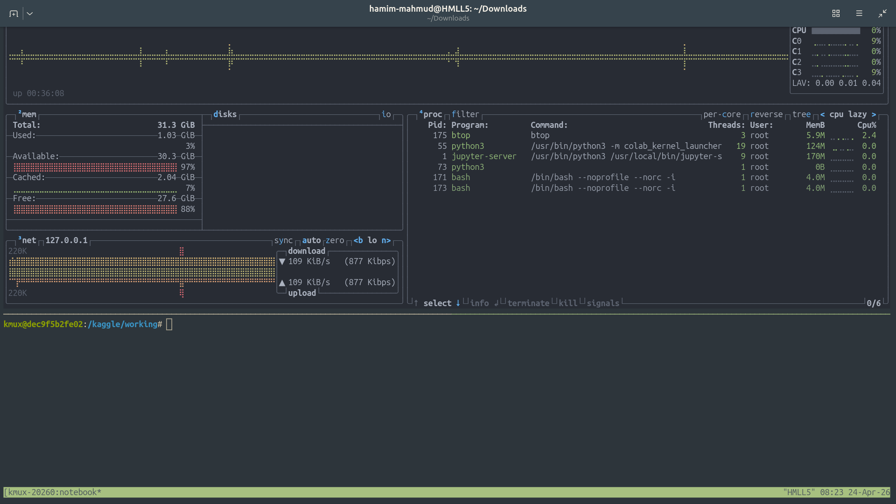
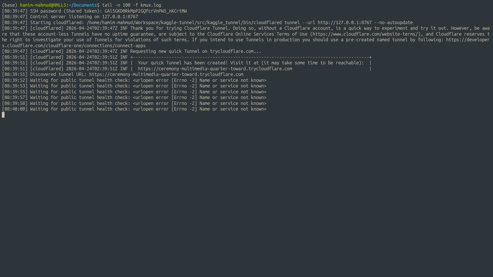
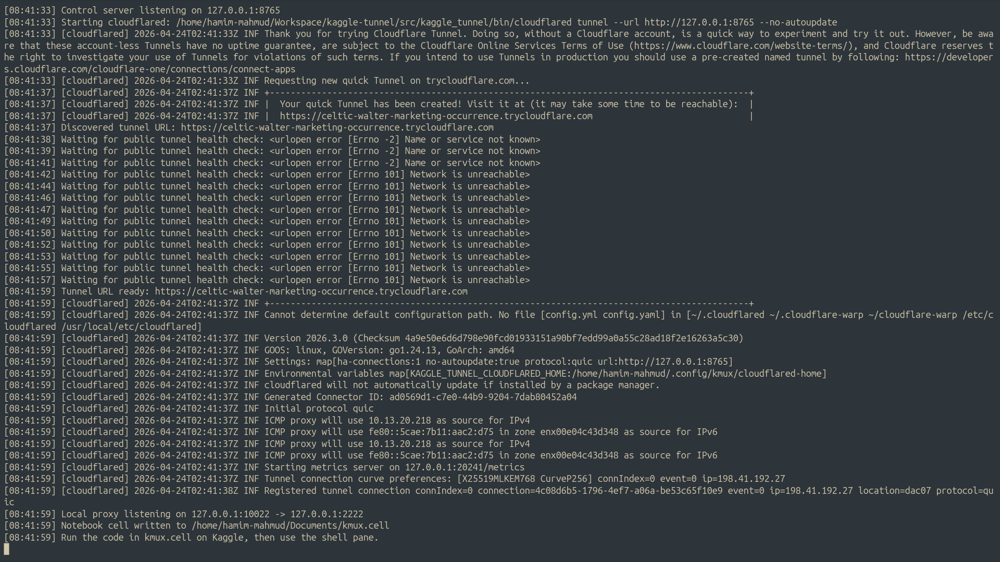
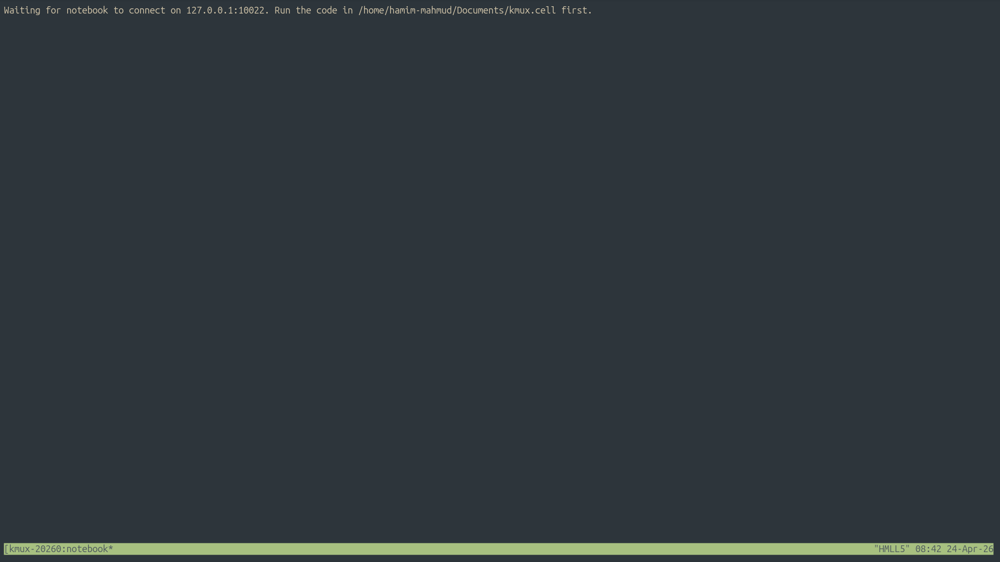
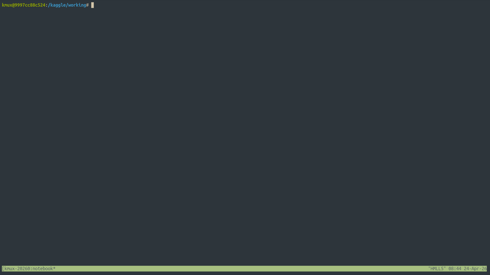

# Kaggle Tunnel
A tmux wrapper for kaggle notebook servers. It uses kaggle tunnel as a transport layer.


## Install

1. Install Python 3.11+.
2. Install the GUI/system packages your OS needs.

Ubuntu/Debian:

```bash
sudo apt update
sudo apt install -y python3-tk openssh-client tmux
```
> **Note:** Optionally you can install cloudflared tunnel form official website.

3. Install the package:

```bash
python -m pip install .
```

For editable local development, you can use:

```bash
python -m pip install -e .
```


## Run

### Open a terminal and run following command:

```bash
kmux
```

This will generate two files:
- kmux.log
- kmux.cell

### Create a new terminal and run following command:

```bash
tail -n 100 -f kmux.log
```
You will see logs generated by kmux:



Once the tunnel is generated you need to copy the code in `kmux.cell` and paste it to your notebook. You can close the tunnel than.



If tunnel is successfully created you will see this output:


### Done!

Wait for notebook to connect.


## Run A Local Script On Kaggle

After the tunnel is up, the notebook cell is running, and the local proxy has been started, you can upload a local Python file to the notebook and execute it over SSH with `kaggle-tunnel-run`.

Examples:

Linux/macOS:

```bash
kaggle-tunnel-run ./your_script.py
kaggle-tunnel-run ./your_script.py -- arg1 arg2
kaggle-tunnel-run ./your_script.py --password "YOUR_SHARED_TOKEN"
```


Defaults used by `kaggle-tunnel-run`:

- SSH host: `127.0.0.1`
- SSH port: `10022`
- SSH user: `notebook`
- Remote upload directory: `/kaggle/working`

You can also override them if needed:

```bash
kaggle-tunnel-run ./your_script.py --host 127.0.0.1 --port 10022 --user notebook --remote-dir /kaggle/working
```


## Important note

The generated notebook helper is a long-running control agent. Keep that cell running while you use the desktop app.

The embedded SSH server now reuses a host key saved at `/kaggle/working/.kaggle_tunnel/ssh_host_key`, which helps avoid repeated host key warnings across notebook restarts in the same Kaggle workspace.

If you already connected before this change and see `REMOTE HOST IDENTIFICATION HAS CHANGED!`, remove the stale entry once with:

```bash
ssh-keygen -R "[127.0.0.1]:10022"
```

## cloudflared notes

- The app auto-downloads `cloudflared` Linux.
- When installed as a package, downloaded binaries are saved in the user data directory for `kaggle-tunnel`.
- Bundled fallback binaries are also included in the package for Windows and Linux.
- If you already installed `cloudflared` globally, the app should detect it from `PATH`.
