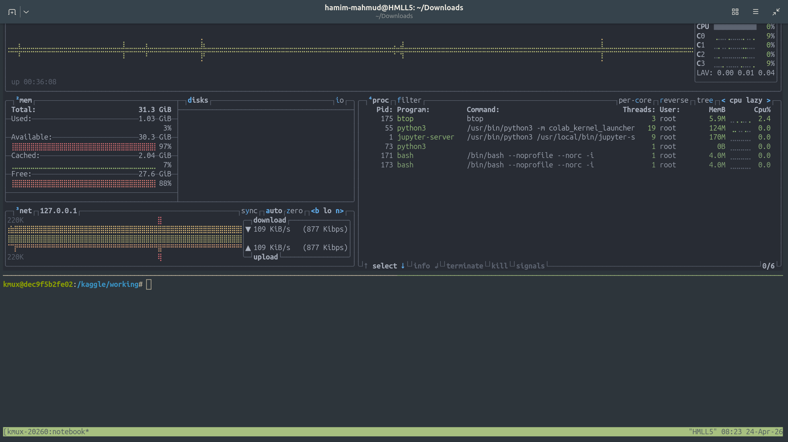

# Kaggle Tunnel

A complete toolchain for connecting Kaggle notebooks back to your local machine via SSH through Cloudflare tunnels. Uses a **reversed-direction** architecture — the Kaggle VM initiates outbound connections, so no inbound firewall rules are needed.



## Architecture

```
Kaggle VM (notebook)         Cloudflare           Local PC
─────────────────────        ──────────           ────────
┌──────────────────┐        ┌──────────┐   ┌──────────────────────┐
│  SSH server      │        │ Tunnel   │   │ Desktop App (Tauri)  │
│  WS proxy        │◄───────│ Broker   │──►│  + Proxy (:10022+)   │
│  cloudflared     │        │ (Worker) │   │  + GNOME Extension   │
│  tunnelbroker    │        └──────────┘   └──────────────────────┘
└──────────────────┘
```

## Components

### 📦 Python Package (`kaggle-tunnel`)
Core tunnel logic:
- **Notebook cell template** — auto-generated Python code to run on Kaggle (SSH server + WS proxy + cloudflared)
- **Local proxy** — bridges TCP (SSH) ↔ WebSocket (cloudflared tunnel)
- **Tunnelbroker client** — registers/discovers peers via Cloudflare Worker API

### 🖥️ Desktop App (`Kaggle Instance Manager`)
A Tauri v2 + SvelteKit desktop application:
- **Dashboard** — table of discovered VM instances with status, host, tunnel URL
- **Per-instance proxy** — start/stop SSH proxies with auto-assigned ports
- **One-click SSH** — launches terminal with `sshpass`-prefilled password
- **Settings** — configure tunnelbroker URL, group, token; generate notebook cells
- **Multi-VM support** — manage multiple Kaggle instances simultaneously

### 🧩 GNOME Shell Extension (`kgtun-gnome`)
Panel indicator showing instance count with dropdown for quick actions:
- SSH connect, Copy SSH command, Copy tunnel URL
- Copy notebook cell, Open Manager App, Refresh, Settings

## Install

### Prerequisites

```bash
sudo apt update
sudo apt install -y python3 python3-pip python3-aiohttp sshpass openssh-client
```

### Python Package

```bash
pip install -e .
```

### Desktop App

```bash
cd "Kaggle Instance Manager"
npm install
npm run tauri dev      # Development mode
npm run tauri build    # Build .deb / .AppImage
```

### GNOME Extension

```bash
cd kgtun-gnome
make install
# Enable in GNOME Extensions app
```

## Quick Start

1. **Open the Desktop App** and go to **Settings**
2. Configure your **Tunnelbroker URL** (default: `https://tunnelbroker.hamimmahmud0.workers.dev`)
3. Click **Copy Notebook Cell** — a cell with a random instance name is generated
4. **Paste the cell** into a Kaggle notebook and run it
5. Back in the app, click **Refresh** — your instance appears
6. Click the **Play button** (▶) to start the SSH proxy
7. Click the **SSH button** to open a terminal, or **Copy SSH command** to connect manually

## SSH Password

The SSH password is derived automatically from the **Group Token** (first 10 alphabetic characters). Both the notebook cell and the desktop app compute it the same way, so no manual password exchange is needed.

## Building Packages

### .deb / .AppImage

```bash
cd "Kaggle Instance Manager"
npm run tauri build
```

Output:
- `src-tauri/target/release/bundle/deb/kaggle-instance-manager_0.2.0_amd64.deb`
- `src-tauri/target/release/bundle/appimage/kaggle-instance-manager_0.2.0_amd64.AppImage`

### Snap

```bash
sudo usermod -a -G lxd $USER
# Log out and back in, then:
snapcraft
```

## Test

Run the local end-to-end proxy test:

```bash
python3 scripts/test_proxy_local.py --token "test-token"
```

This simulates both the VM side (SSH server + WS proxy) and the PC side (local proxy) on your machine.

## cloudflared notes

- The app auto-downloads `cloudflared` on Linux.
- When installed as a package, downloaded binaries are saved in the user data directory.
- Bundled fallback binaries are included for Windows and Linux.
- If you already installed `cloudflared` globally, the app detects it from `PATH`.

## Debugging

- **Proxy logs** (when started by app): `/tmp/kgl-proxy-logs/{instance_name}.log`
- **Manual proxy**: `python3 -m kaggle_tunnel.proxy --tunnel-url wss://.../ws --token <token> --local-port 10022 -v`
- **Notebook output**: visible below the cell in Kaggle

## Important note

The generated notebook cell is a long-running control agent. Keep that cell running while you use the desktop app.

The embedded SSH server reuses a host key saved at `/kaggle/working/.kaggle_tunnel/ssh_host_key`, avoiding repeated host key warnings across notebook restarts.

If you see `REMOTE HOST IDENTIFICATION HAS CHANGED!`, remove the stale entry:

```bash
ssh-keygen -R "[127.0.0.1]:10022"
```

## Donations

If you find this project useful, consider supporting it:

| Currency | Address |
|----------|---------|
| **BTC**  | `bc1q6r83agw2e3fh0gja6k8ukd8rv7aq550ze5ankn` |
| **ETH / USDT / BNB** | `0x9162379EA7f99552CF8eDD3FC7B3Be1db6cb4f56` |
| **SOL**  | `AjM3ann6iGS3q3EjD5Uzu1aNdaZ4EbcsesyCxmgCvZ3D` |

[Full donation page](DONATIONS.md)
